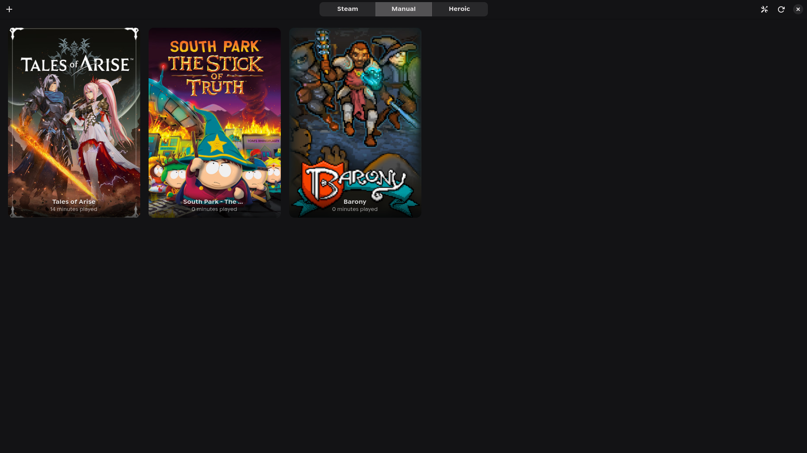

# GameHub

GameHub is a unified game launcher for Linux designed to bring your Steam, Heroic, and Windows games into one GTK-powered interface.



## Key Features

- **Unified Library**: Automatically scans Steam and Heroic Launcher titles (Epic, GOG).
- **Manual Game Addition**: Add any Windows executable with a custom configuration dialog.
- **Advanced Runners**: Choose between Proton-GE and Native execution for manual games.
- **Launch Customization**: Specify custom launch arguments and set custom artwork.
- **OnlineFix Support**: One-click configuration for online fixes (Steamworks Fix, etc.).
- **Artwork Integration**: Built-in Steam ID lookup and local artwork support.
- **Playtime Tracking**: Keeps track of your gaming sessions across all platforms.
- **Native Experience**: Built with GTK4 and Libadwaita for a seamless Linux desktop feel.

## Prerequisites

- Python 3.x
- GTK4 & Libadwaita
- Proton-GE (recommended for manual games)
- `requests` (for artwork fetching)
- `psutil` (for playtime tracking)

## Getting Started

1. Clone or download the repository.
2. Run the modern graphical installer. It will handle system dependencies and register the application in your desktop menu:
   ```bash
   python3 install.py
   ```
3. Once installed, you can launch GameHub from your application menu. Alternatively, you can run it directly:
   ```bash
   python3 src/main.py
   ```

## License

This project is licensed under the **GNU General Public License v3.0 (GPLv3)**. See the [LICENSE](LICENSE) file for the full license text.

## Credits

- OnlineFix logic inspired by [onlinefix-linux](https://github.com/ZzEdovec/onlinefix-linux).
