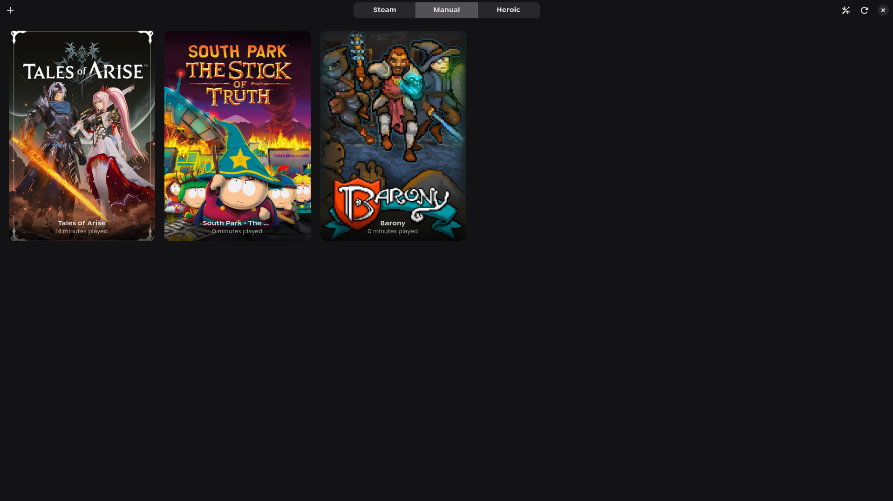

# GameHub

GameHub is a unified game launcher for Linux designed to bring your Steam, Heroic, and Windows games into one GTK-powered interface.



## Key Features

- **Unified Library**: Automatically scans Steam and Heroic Launcher titles (Epic, GOG).
- **Manual Game Addition**: Add any Windows executable with a custom configuration dialog.
- **Advanced Runners**: Choose between Proton-GE and Native execution for manual games.
- **Launch Customization**: Specify custom launch arguments and set custom artwork.
- **OnlineFix Support**: One-click configuration for online fixes (Steamworks Fix, etc.).
- **Artwork Integration**: Built-in Steam ID lookup and local artwork support.
- **Playtime Tracking**: Keeps track of your gaming sessions across all platforms.
- **Native Experience**: Built with GTK4 and Libadwaita for a seamless Linux desktop feel.

## Prerequisites

- Python 3.x
- Supported Distributions: Arch Linux, Fedora, Ubuntu/Debian (or derivatives)

## Installation

We provide an automated setup script that handles dependencies and installation for you.

1. **Download the Repository**
   Clone the repository to your local machine:
   ```bash
   git clone https://github.com/CubixGamer12/GameHub.git
   cd GameHub
   ```

2. **Run the Setup Script**
   Execute the setup script. It will detect your distribution, install necessary system dependencies (like GTK4 and Libadwaita), and launch the graphical installer.
   ```bash
   ./setup.sh
   ```

3. **Follow the Installer**
   The graphical installer will guide you through the process. It will:
   - Install the application to `~/.local/share/gamehub`.
   - Create a dedicated virtual environment.
   - Add a desktop entry and icon to your application menu.

4. **Launch**
   Once installed, you can launch **GameHub** from your application menu or run `gamehub` in your terminal.

## Updating

GameHub includes a built-in update mechanism. To update to the latest version:

1. Open a terminal in the downloaded `GameHub` folder.
2. Run `./setup.sh` again.
3. If a new version is available on GitHub, the script will ask if you want to update.
4. Press `y` to pull the latest changes and reinstall/update the application.

## Manual Installation (Advanced)

If you prefer to install manually or are on an unsupported distribution:

1. Install `python-gobject`, `gtk4`, `libadwaita`, and `python-pip` using your package manager.
2. Run the installer directly:
   ```bash
   python3 install.py
   ```

## License

This project is licensed under the **GNU General Public License v3.0 (GPLv3)**. See the [LICENSE](LICENSE) file for the full license text.

## Credits

- OnlineFix logic inspired by [onlinefix-linux](https://github.com/ZzEdovec/onlinefix-linux).
